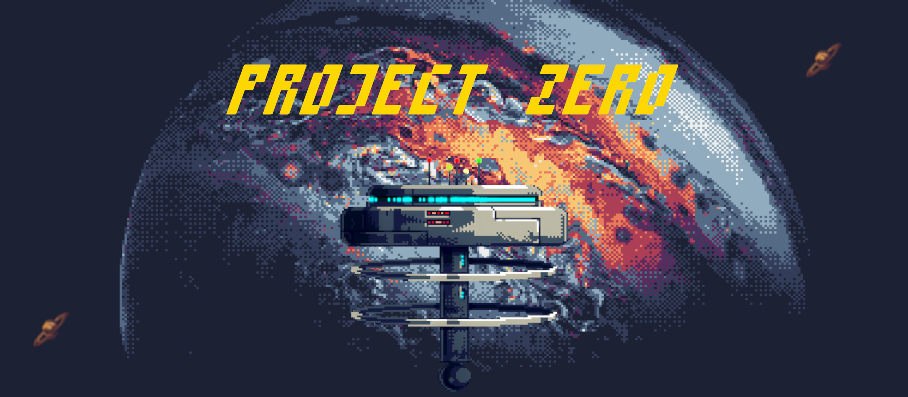

# Project Zero

**Game developed for the Game Development course at Unifi.**



## Brief Description:
[Project Zero] is a top-down 2D shooter that focuses on parrying, shooting, and fast-paced gameplay. Similar games include *Hotline Miami 1 & 2*, *Door Kickers*, and *Nuclear Throne*.

## Setting:
The game is set in the near future, aboard a space station orbiting Jupiter. A twisted competition, similar to a Hunger Games scenario, is played and streamed to the Metanet (or Hypernet, if we want a more serious tone). You are one of the competitors, and your objective is to survive, escape, and collect as much cash as possible. To succeed, you’ll need to paint the station red with blood.

## Game Mechanics:

### Movement:
- **Movement** Standard top-down movement, using `WASD` for movement and the mouse to aim.
- **Dash** Press [Space] to dash a short distance. The dash direction is determined by the mouse pointer.
- **Jump** There is no jump mechanic.
- **Free camera** Hold `shift` for a free camera view
- **F equip secondary**
- **Q shoot with secondary**
- **Mouse left button** shoot with primary
- **Mouse right button** leave the primary weapon on the ground

When the ammo of the primary are finished you can throw a gun at an enemy and kill it eventually.

### Weapons:
Weapons are divided into **Primary** and **Secondary** categories. Enemies can use **Primary** based on an internal list of equippable weapons but cannot equip/use any secondary.

#### Primary Weapons:
Primary weapons are your main damage-dealers, and they are subdivided into **Ranged** and **Melee** weapons.

##### Ranged Weapons:
Ranged weapons are effective at long range but have limited ammunition.

**List of Ranged Weapons:**

- **Pistol**:  
  - Firing Rate: Medium  
  
- **Assault Rifle**:  
  - Firing Rate: High  

##### Melee Weapons:
Melee weapons are effective only at close range, don’t require ammunition, and can parry enemy melee attacks with [Left Click].  
**Parry mechanic:** Timing is key. If you successfully parry, the enemy becomes stunned for a short period, than if you swing again in that period and the enemy gets hit, it dies.

**List of Melee Weapons:**

- **Sword**:  
  - Range: Low  
  - Swing Speed: Medium  

#### Secondary Weapons:
Secondary weapons are items activated with [Q].

- **Teleport**:  
  - Effect: Teleports the player to the cursor’s position  
  - Charges: 3 (Not Rechargeable)

### Levels:
Levels are handcrafted and consist of multiple areas (scenes). Each area contains enemies that patrol predefined paths or guard specific points. Weapons and equipment spawn in special objects called **E-Boxes*. The player begins at one end of the map, and the exit is located on the opposite side. The exit unlocks when all enemies of the scene are killed. If the player dies before reaching the exit, the level resets, and all equipment is lost.Eweapons that have a blue background are primary weapons, weapons that have orange background are secondaries.

### Enemies movements:

- **Patrol Movement**

> Moves around a specified pattern

- **Chase Movement**

> Chases the enemy and handles repositioning using waypoints for avoiding obstacles

- **Weapon Finder Movement**

> If unequipped or an enemy finished its ammo, it tries to rech the closer equippable weapon based on its own list of equippable weapons type. Weapoons left on the ground by the player are equippable by the enemies too. Some certain weapons can be marked as `Available to the player only` and it is equippable by the player only the first time, then, if the player leaves the gun on the ground it will be available to the enemies too.

- **Coward Movement**

> When an enemy has not a weapon equipped and no weapon is available on the ground it starts to run away from the player until eventually, another gun is available and pickable by that enemy.

- All movmeents are based on graph and graph teory for reaching a certain point on the map.

### Enemies:
Enemies are categorized into:

- **Goon**:  
  Basic enemy, killed with a single shot from any damage-dealing weapon. It can equip any `Ranged` and `Melee` weapon.

- **Dog**:  
  Fast, melee-based enemies that rush the player on sight. It does not equip  `Ranged` nor `Melee` weapons (such as sword) but it is considered a melee itself.

### Reward System:
- **Scoring:** Every kill earns points. The points are calculated based on a formula:

```
*  More shots → higher score
*  The term w₁·S grows linearly with shots delivered.
*
*  Less chase time → higher score
*  The term w₂·(1/(T+ε)) is largest when T is small, and falls off as T increases.
*
*  Plus base points
*  Simply add existing GetBasePoints().
* in other words:
*
* - the less is the TotalChasedTime, the higher will be the point
* - the higher are the total shots delivered, the higher will be the point
* - sum the base points to the calculation done on the first 2
```

### UI

#### Main Menu:
The main menu has an animated background and three buttons:
1. **Start**: Starts the game.
2. **Stats**: Shows the previous scores.
3. **Options**: Opens the options UI.
4. **Quit**: Exits the game and returns to the operating system.
